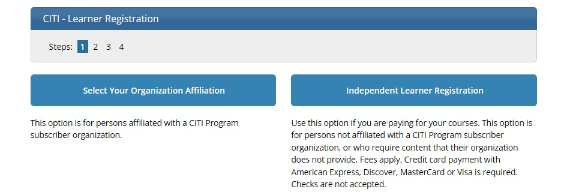
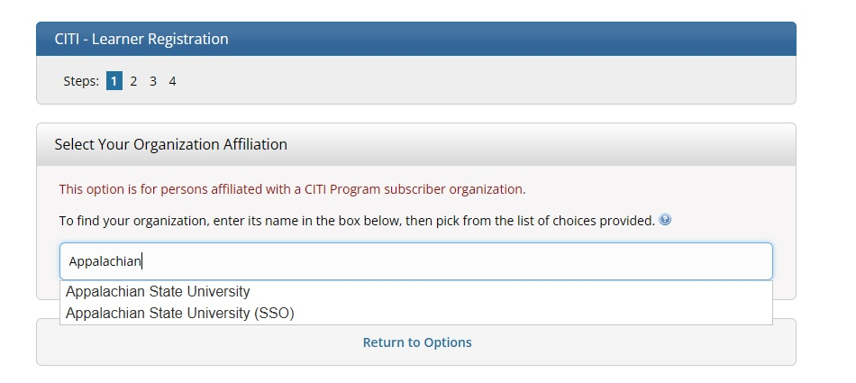

```{r, global_options, include = FALSE}
knitr::opts_chunk$set(
  message = FALSE,
  warning = FALSE,
  comment = NA,
  echo = FALSE,
  fig.align = "center"
)
library(fontawesome)
```


## Why Research Ethics Training?

The 1946--1947 [*Doctors' Trial*](https://encyclopedia.ushmm.org/content/en/article/the-doctors-trial-the-medical-case-of-the-subsequent-nuremberg-proceedings) was one of twelve WWII war-crimes trials that are known collectively as the *Nuremberg Trials*. Horrors had been committed on human beings in the name of "medical" research. Unfortunately, these kinds of grossly unethical actions were not limited to the war years, nor isolated to Nazi territory. In this training, you will learn about the development of human subjects research protections in the United States.

```{r image_grobs, fig.show = "hold", out.width = "50%", fig.align = "default"}
knitr::include_graphics(c("images/doctorstrial.jpg", "images/tuskegeeexperiment.jpg"))
```


## CITI Training Website

Go to [https://about.citiprogram.org/](https://about.citiprogram.org/) and choose **Register**.

```{r}
knitr::include_graphics("images/CITI_01.jpg", dpi = 200)
```


## Organizational Affiliation

Choose **Select Your Organizational Affiliation** to get started.

```{r out.width = "100%"}

```


## Choose Appalachian

Search for and choose **Appalachian State University (SSO)**. You will be able to sign in with your usual ASU login and password.

```{r out.width = "100%"}

```


## Log In Using ASU ID and PW

Check the boxes and **Log In with Appalachian State University**.

```{r}
knitr::include_graphics("images/CITI_04.jpg", dpi = 125)
```


## Start to Add Your Course

Click the **Add a Course** link to start the search for your course. From here you will be guided through the process required to add the **Social/Behavioral Research Course---Basic Course**.

```{r}
knitr::include_graphics("images/CITI_05.jpg", dpi = 110)
```


## Human Subjects Research

Check the box next to **Human Subjects Research**, then **Next**.

```{r}
knitr::include_graphics("images/CITI_06.jpg", dpi = 125)
```


## NO to Previous Completion

Click **NO, I have NOT completed the Basic Course...**, then **Next**.

```{r}
knitr::include_graphics("images/CITI_07.jpg", dpi = 125)
```

**If you HAVE done this course in the past, contact Dr. Thomley.** Do not proceed any farther.


## Social & Behavioral Research

Click **Social & Behavioral Research Investigators...**, then **Next**.

```{r}
knitr::include_graphics("images/CITI_08.jpg", dpi = 125)
```


## Courses Ready to Begin

You should now see the **Social/Behavioral Research Course** in your list of available courses. You do not have to complete the entire course in one sitting. CITI will save your progress.

```{r}
knitr::include_graphics("images/CITI_09.jpg", dpi = 125)
```


## Start the Course

When you start the course, you will see at the very top that CITI keeps a running total of your module progress and score. I have completed two modules and I earned a cumulative 100% on the two post-module quizzes.

```{r}
knitr::include_graphics("images/CITI_10.jpg", dpi = 125)
```


## The Learning Modules

The modules are listed below, along with your completion date and quiz scores. This shows the first three---two complete and the third ready to start.

```{r}
knitr::include_graphics("images/CITI_11.jpg", dpi = 135)
```


## Alternate Presentation Modes

When you open a module, you will be given information to read. You can **Switch View** to a video version of the material.

```{r}
knitr::include_graphics("images/CITI_12.jpg", dpi = 130)
```


## 

You can **Switch View** from the video to the static page as well.

```{r}
knitr::include_graphics("images/CITI_13.jpg", dpi = 140)
```


## End-of-Module Quizzes

```{r}
knitr::include_graphics("images/CITI_14.jpg", dpi = 130)
```


##

Each module has a quiz with about 3 multiple choice questions. After you have submitted all questions, you will see the results, including correct answers for missed questions.

```{r}
knitr::include_graphics("images/CITI_15.jpg", dpi = 130)
```

These results will also show up in the overall list of modules in the ***Social/Behavioral Research Course---Basic Course*** and your records page. Check your cumulative percentage! You need to get ***80% or better*** overall to pass and get credit.


## When You Are Done

After you are done with the entire module, go to your records page to verify that you have been marked as complete. Notice that Dr. Thomley has completed more than one CITI course in the last few years.

You should have only one row in your results table if you are new to CITI. Click on **View-Print-Share** to access the evidence you need to submit for STT 1810.

```{r}
knitr::include_graphics("images/CITI_16.jpg", dpi = 140)
```


## Completion Report

Click on **Copy Link** for your **Completion Report**. Submit the link in the appropriate assignment on **AsULearn**. You can see what the report looks like by clicking View/Print.

```{r}
knitr::include_graphics("images/CITI_17.jpg", dpi = 150)
```


## 

Click on the **Copy `r fa(name = "copy")`** button to copy the link for your submission.

```{r}
knitr::include_graphics("images/CITI_18.jpg", dpi = 120)
```

<p>&nbsp;</p>
<p>&nbsp;</p>

<hr>
<p style="text-align: center; font-size: 36px;">Congratulations on your achievement!</p>
<hr>

