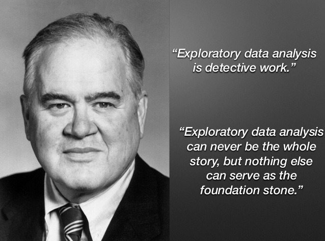
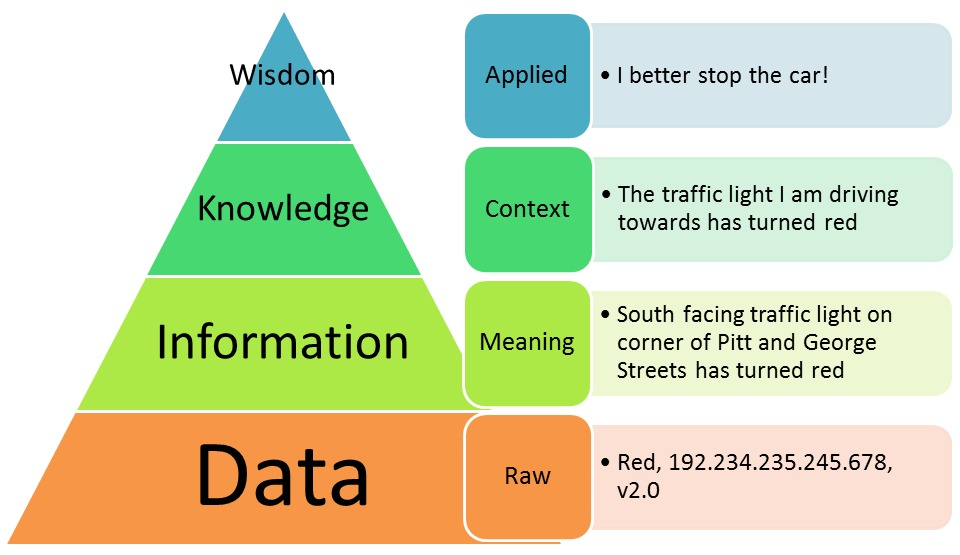

```{r global_options, include = FALSE}
knitr::opts_chunk$set(
  message = FALSE,
  warning = FALSE,
  comment = NA
)
```


## Before We Begin…

These slides are meant to accompany [*Introduction to Statistical Investigations, 2nd Edition*](http://www.isi-stats.com/isi/index2nd.html) --- Section P.2 Exploring Data.

*This content does not replace reading the relevant textbook section.* It is for class presentation, review, and reference.

See [AsULearn](https://asulearn.appstate.edu/) for supplemental readings, videos, assignments, and searchable Glossary of ISI Textbook Vocabulary.


## Learning Goals for Preliminaries

* Use the six-step statistical investigation method to carry out any statistical study. [Section P.1]
* Describe distributions of quantitative variables. [Section P.2]
* Use simulations to explore and understand probabilities. [Section P.3]

  *We will use these investigative methods throughout the course.* 

<hr>

One more important goal of this (and every other) section is for you to learn the vocabulary of statistical investigations/thinking. 

You need to **"speak the language"** to understand what is being taught in class, and also to express ideas that will demonstrate your understanding and proficiency with the material. 


## Learning Goals for Section P.2

* Describe the distribution of a quantitative variable in terms of shape, center, variability, and unusual observations.
* Compare shapes between two or more distributions that are displayed in dotplots or histograms.
* Compare the centers between two or more distributions that are displayed in dotplots or histograms.
* Compare the variability between two or more distributions in dotplots or histograms.
* Interpret graphs that contain a color-coded third variable.
* Make predictions about centers/means, and about variability / standard deviations, based on the context of the variable.

***To draw conclusions from data, we need to understand the data.***


##

<p>John Tukey (1915--2000), noted mathematician, statistician, and computer scientist, author of _Exploratory Data Analysis_ (1977) --- Some of these methods are still relatively new and evolving.<p>

<p style="text-align:center;"></p>

<p>Tukey also advocated for development of computerized tools to facilitate EDA, so people could focus on ***interpreting results***.</p> 


##

<p style="text-align:center;"></p>

We process raw ***data*** with statistical methods to extract usable ***information***. But that is only part of the story! To give statistical results meaning and learn from them, we must interpet them in the ***appropriate context***. This includes units of measurement.


## Section P.2 New Vocabulary

Let's review (Section 1.1) and expand our statistics vocabulary!

* data table
* units of measurement
* spread / variability
* quantitative variable
* standard deviation (or SD)
* describing the behavior (distribution) of a variable<br>
-- shape<br>
-- center<br>
-- variability<br>
-- unusual observations / features


## A "Tidy" Dataset

Data are usually stored in a rectangular representation that has various names, including ***data table*** or statistical spreadsheet.

Most of the data we will work with in STT1810 is in this format. Real life data is usually far messier and can require a great deal of tidying up, but that is beyond the scope of this class.

<p style="text-align:center; font-size: 10px;"><br>Source: [R for Data Science: Tidy Data](http://r4ds.had.co.nz/tidy-data.html) --- note that *observations* is another name for *observational units*<br></p>


## Units & Spread

**quantitative variable:** numerical characteristics or values on which ordinary arithmetic operations make sense (counts or measurements, which may include *units of measure*)

**units of measurement:** many quantitative measurements have scientific units attached (e.g.,  decibels, inches, lumens, minutes, kg, °F, liters) to specify the scale of quantity or amount

**spread / variability:** how spread out the data values are on the number line, including (but not limited to) the range of values---*this is one of the most fundamental ideas in statistics!*

**standard deviation (or SD):** a measure that is commonly used to quantify spread / variability; we can interpret it as the typical distance between data values and the distribution mean


## Distribution of a Variable

Categorical variables are summarized by counts / proportions. We can visualize these using bar graphs.

<hr> 

Quantitative data are described by how / where they occur on the number line. Distribution behavior includes:

**shape:** the overall pattern and "clumping" of the data when we graph it (e.g., using a dotplot or histogram)

* Is the distribution symmetric or asymmetric? 
* Is the distribution mound shaped (one peak)? 
* Are there several distinct peaks or clusters?

Sometimes we need to make more than one graph to decide.


## Some Possible Shapes

We often see symmetric, mound-shaped distributions like the top left. However, infinitely many shapes are possible.

```{r, echo = FALSE, fig.align="center"}
knitr::include_graphics("../images/histogramshapes.png", dpi = 75)
```


## Dotplots

A dotplot is a type of graph that displays each observation for a given numerical variable as a dot on a number line. These plots work well for small to moderately-sized datasets.

If two or more observations share the same value, which is very common, the dots are stacked vertically.

***Example:*** The dotplot below shows the final exam scores for 93 statistics students. What were the lowest and highest scores?

```{r, echo = FALSE, fig.align="center"}
knitr::include_graphics("https://stat-jet-asu.github.io/Moodlepics/glossary/dotplot.jpg")
```


## Histograms

A histogram displays the distribution of a numerical variable by dividing the number line into several categories called "bins". 

The y-axis shows the count of data points in each bin (height of the bars). Every data point must be included in exactly one bin.

***Example:*** Histogram of the final exam scores. What is the shape?

```{r, echo = FALSE, fig.align="center"}
knitr::include_graphics("https://stat-jet-asu.github.io/Moodlepics/glossary/histogram.png")
```


## Center, Spread, Outliers

**center:** a middle or typical value of a quantitative variable; the "center of mass" for the distribution (e.g., mean)

**variability:** once we have identified the center, how spread out are the data---are most within a certain range of values?

* standard deviation is one of the most common quantitative measures of variability; we will abbreviate it as **SD**

**unusual observations / features:** points that deviate markedly from the overall pattern of the other data values (i.e., outliers); also other unusual features such as multiple modes
    
* sometimes we can explain unusual features or outliers using another variable (e.g., some kind of grouping)


## Possible Reasons for Outliers

This information does not appear in your ISI textbook, but it is good to know when discussing outliers in data!

* The outlier is a legitimate value and it represents the natural variability for the group and variable measured. Sometimes these are the *most* interesting data points!

* The outlier is a mistake in measurement, recording, or data entry. *It should be corrected or discarded.*

* The measurement is accurate, but the observational unit it was collected from does not belong to the group we intended to measure; for example, including a kindergartener's height in a dataset that is meant to answer a question about college students' measurements. *It should be discarded.*


## *Think About It*

Mary records the ages of people entering a McDonald’s near the interstate (today). Colleen records the ages of people entering a snack bar on a college campus (today). Which would you expect to have a *larger* standard deviation of ages?

* Mary (McDonald’s)

* Colleen (campus snack bar)

Explain how you made your decision and support your answer.

**Extension:** Would a 60-year-old person be an outlier in either of the two groups? Why or why not?

*Hint: Would a sixty-year old be common to see at McDonald's? What about at a college snack bar?* 

