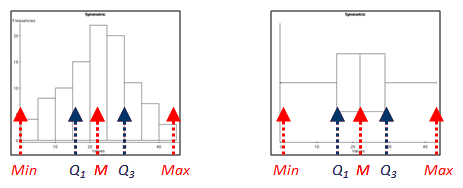
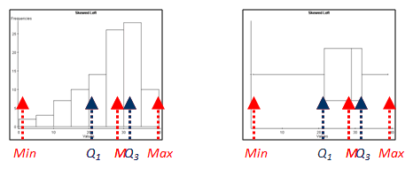
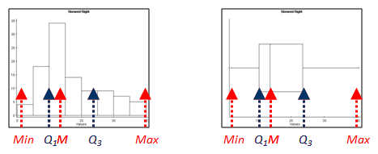

```{r global_options, include = FALSE}
knitr::opts_chunk$set(
  message = FALSE,
  warning = FALSE,
  comment = NA
)
```

## Before We Begin…

These slides are meant to accompany the text [*Introduction to Statistical Investigations, 2nd Edition*](http://www.isi-stats.com/isi/index2nd.html) --- Section 6.1 Comparing Two Groups: Quantitative Response.

*This content does not replace reading the relevant textbook section.* It is for class presentation, review, and reference.

See [AsULearn](https://asulearn.appstate.edu/) for additional readings, videos, and assignments.

You can print these slides to a pdf for offline use using the print function in your browser.


## Recall: The Six-Step Spiral Process

:::::: {style="display: flex;"}

::: {}

```{r, echo = FALSE, fig.align="center"}
knitr::include_graphics("../images/sixstepsfourpillars.png", dpi = 100)
```

:::

::: {}

&nbsp;&nbsp;&nbsp;&nbsp;&nbsp;

:::

::: {}

* In Chapters 1 through 4, our research questions usually involved a single proportion parameter $\pi$.

* In Chapter 5 we explored differences in proportions for two groups ($\pi_1 - \pi_2$).

* In Chapter 6, we will apply what we learned to assess *quantitative* variables.

* Now we will compare two group means ($\mu_1 - \mu_2$).


:::

::::


## Learning Goals for Chapter 6

Chapter 6 extends what we learned about statistical significance in previous chapters to compare two groups with parameters $\mu_1$ and $\mu_2$, where $\mu$ is the population *mean*. A sample mean will be designated with $\bar{x}$. We typically will have a null of $H_0: \mu_1 = \mu_2$ or $H_0: \mu_1 - \mu_2 = 0$ (i.e., *no difference* between groups). 

We can also estimate the size of difference $\mu_1 - \mu_2$.

<hr>

* Compare two sample means numerically and graphically. [Section 6.1]
* Carry out a simulation-based analysis to investigate the difference between two population means. [Section 6.2]
* Carry out a theory-based analysis to investigate the difference between two population means. [Section 6.3]


## Learning Goals for Section 6.1

* Calculate or estimate the mean, median, quartiles, five number summary, and interquartile range from a dataset and understand what these are measuring.
* When comparing two quantitative distributions, identify which has the larger mean, median, standard deviation, and inter-quartile range.
* Identify whether there is likely an association between a binary categorical variable and a quantitative response variable.

ALSO, we have two new symbols for use with quantitative data.

* <mark>$\mu$</mark> = population mean (Greek letter mu, pronounced "mew")
* <mark>$\bar{x}$</mark> = sample mean (usually pronounced "x-bar")


## Section 6.1 New Vocabulary

* five-number summary
   * minimum
   * lower quartile
   * median
   * upper quartile
   * maximum
* interquartile range
* boxplot

We also will revisit several vocab terms from the Preliminaries and introduce a guideline for identifying data points that might be considered outliers in a quantitative distribution.


## Descriptive Statistics

**<mark>minimum</mark> :** the smallest value observed for the variable

**<mark>lower quartile</mark> :** the value that divides the variable so that 25% of the data values lie below (and 75% lie above); also known as the 25th percentile or the symbol Q<sub>1</sub>

**<mark>median</mark> :** a measure of center where 50% of the data values lie below and 50% lie above, when data values are arranged from minimum to maximum; also called the 50th percentile

**<mark>upper quartile</mark> :** the value that divides the variable so that 75% of the data values lie below (and 25% lie above); also known as the 75th percentile or the symbol Q<sub>3</sub>

**<mark>maximum</mark> :** the largest value observed for the variable


## 

**<mark>five-number summary</mark> :** a set of five data summaries composed of minimum, lower quartile, median, upper quartile, maximum. These five values break the data into four parts, with each part containing 25% of the data points.

**<mark>interquartile range</mark> :** a measure of spread for the middle 50% of the data values, which is found by taking the distance between the upper and lower quartiles; i.e., IQR = Q<sub>3</sub> and Q<sub>1</sub>

**<mark>boxplot</mark> :** a visual display of the five-number summary, which can help us identify symmetry and outliers (**note:** the picture below is a bit off-scale---the fences are too close to Q<sub>1</sub> and Q<sub>3</sub>)

```{r, echo = FALSE, fig.align="center"}
knitr::include_graphics("../images/boxplotkernler01.gif", dpi = 225)
```
<p style = "text-align: center; font-size: 10px;"><br>Image Source: [Prof. Dan Kernler for Mth120 Statistics I at Elgin Community College](https://faculty.elgin.edu/dkernler/statistics/ch03/3-5.html)</p>


## Recall: Exploring Data (Section P.2)

Quantitative data are described by how / where they occur on the number line. Distribution behavior includes:

**<mark>shape</mark> :** the overall pattern and "clumping" of the data when we graph it (e.g., using a dotplot or histogram; *now also a boxplot*)

**<mark>center</mark> :** a middle or typical value of a quantitative variable; the "center of mass" for the distribution (e.g., mean *or median*)

**<mark>variability</mark> :** once we have identified the center, how spread out are the data---are most within a certain range (e.g., SD *or IQR*)?

**<mark>unusual observations / features</mark> :** points that deviate markedly from the overall pattern of the other data values (i.e., *now we can use boxplots to detect outliers*); also other unusual features such as multiple modes (note: boxplots are *not* good for this)


## Anatomy of a Boxplot

Boxplots may be drawn horizontally or vertically (*left* = *lower*).

```{r, echo = FALSE, fig.align="center"}
knitr::include_graphics("../images/boxplotanatomy.png", dpi = 100)
```

* lower outlier = data value < $\text{lower quartile} - 1.5 * IQR$
* upper outlier = data value > $\text{upper quartile} + 1.5 * IQR$


## Boxplots and Skewness

**Symmetric:** The lower quartile is (roughly) equally far from the median as the upper quartile; he left whisker is (roughly) equal in length to the right whisker. Overall, does not demonstrate a consistent pattern of skewness (*see next slide*).

```{r, echo = FALSE, fig.align="center"}

```

The smaller the sample size, the less useful a boxplot might be for discussing shape. In any case, it should be used along with another plot like a histogram.


##

**Left Skewed:** The lower quartile is further from the median than the upper quartile; left whisker is longer than right whisker.

```{r, echo = FALSE, fig.align="center"}

```

**Right Skewed:** It is the reverse or "mirror image" of left skewed.

```{r, echo = FALSE, fig.align="center"}

```
<p style = "text-align: center; font-size: 10px;"><br>Image Source: [Prof. Dan Kernler for Mth120 Statistics I at Elgin Community College](https://faculty.elgin.edu/dkernler/statistics/ch03/3-5.html)</p>


## Which Measures Do We Use?

Why do we need more than one measure to quantify / describe center and variability?

Skewness and outliers, especially in extreme cases, impact some measures more strongly than others.

* Median is a resistant measure of center, whereas the mean is more sensitive to extreme values and skewness.

* IQR is a resistant measure of variability, whereas the standard deviation is sensitive to extreme values and skewness.

Our preference is usually to use mean and standard deviation, but for strongly skewed data or data with large outliers, we may choose median and IQR instead.


## Impact of Skewness / Outliers

The greater the skew, the more different the mean and median will tend to be for a given distribution.

```{r, echo = FALSE, fig.align="center"}
knitr::include_graphics("../images/meanmedianmode.png", dpi = 210)
```
<p style = "text-align: center; font-size: 10px;"><br>Image Source: [Author Diva Jain on Wikimedia Commons](https://commons.wikimedia.org/wiki/File:Relationship_between_mean_and_median_under_different_skewness.png)</p>

<br>

Outliers tend to pull the mean in their direction---large outliers pull the mean up, small outliers pull the mean down.


## Possible Reasons for Outliers

This information is not in your textbook, but it is good to know when discussing outliers! We first saw these in Section P.2.

* The outlier is a legitimate value and it represents the natural variability for the group and variable measured. Sometimes these are the *most* interesting data points!

* The outlier is a mistake in measurement, recording, or data entry. *It should be corrected or discarded.*

* The measurement is accurate, but the observational unit it was collected from does not belong to the group we intended to measure; for example, including a kindergartener's height in a dataset that is meant to answer a question about college students' measurements. *It should be discarded.*

