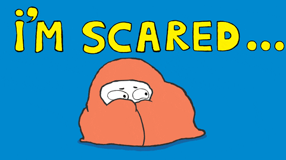

```{r, global_options, include = FALSE}
knitr::opts_chunk$set(
  message = FALSE,
  warning = FALSE,
  comment = NA,
  echo = FALSE,
  fig.align = "center"
)
```

## Greetings!

Welcome to the first day of STT1810 Basic Statistics with Dr. Jill Thomley. To prepare for the beginning of our exciting journey...

* Log on to [AsULearn](https://asulearn.appstate.edu/)!

* Find and open the link "Day 01 Introduction Slides"

* Find and open the link "STT 1810 Fall 2023 Syllabus"

* Begin to familiarize yourself with the course documents and our AsULearn site. **AsULearn is the vital hub of our course for assignments and communication.**

Let us review a few things to make sure we are all familiar with our course structure and expectations. But first...


## What is my Background?

* Medical research in high school at Medical College of Ohio

    I worked with a biomedical engineer who was studying the use of whole-body hyperthermia (heating up the body) to enhance the effectiveness of chemotherapy and radiation.
    
* BA in Psychology from Harvard --- focus in social psychology

    I started out as an engineering major, but I struggled with calculus and physics. I was more interested in psychology research. This is where I first learned statistics (*I hated it*).

* MS in Industrial / Organizational Psychology from [RPI](https://www.rpi.edu/)

    [Industrial-organizational (I/O) psychologists](https://www.apa.org/ed/graduate/specialize/industrial) study human behavior in organizations and teams (*and more statistics*). 


##

* Health care research at the [VA hospital](https://www.va.gov/directory/guide/facility.asp?id=1) in Albany, New York

    We were researching the effectiveness of "managed care" for older veterans with multiple health issues, using a care team (doctor, nurse practitioner, social worker) versus traditional VA primary care practices. *This is where I started to like stats...*

* PhD in [Decision Sciences and Engineering Systems](https://ise.rpi.edu/programs/phd-decision-sciences-and-engineering-systems) from RPI
    * **statistics** and operations research
    * information systems and databases
* Statistical consulting in a variety of disciplines
* Grant evaluation, primarily in STEM education
* Basic, Excel, Fathom, StatCrunch, SPSS, SAS, Minitab, R, Git...
* Also, I just completely &hearts; data! *Sorry not sorry...*


## My Teaching Assistant: Miss Teeny

```{r}
knitr::include_graphics("../images/missteeny.jpg", dpi = 1100)
```


## Syllabus and Schedule

Shortly we will switch over to the **course syllabus** and AsULearn and talk more about objectives and assessments.

As we review, remember that STT1810 is a 3 credit hour course. The standard expectation for a college course is that you spend **2 to 3** hours outside of class for every **1** credit hour of class.

<p style="text-align: center;">3 + ([2 to 3] &times; 3) = 9 to 12 hours per week</p>

**We really only have 2.5 hours of class time per week**&mdash;please don't skip! Be sure to prepare for our limited interaction time.

The prerequisite for STT1810 course is MAT1010, which includes some statistics. If you come into the course with additional stats experience, you ***might*** not need as much time to master course concepts, but do not assume until you try. 


## Your Private Forum

Except for extreme emergencies, all written communication must be handled through your **Private Forum** on AsULearn. This will be new for most of you. 

I prefer this method because it stores all exchanges in a place where we can easily access them all semester long and it keeps my class communications separate from the rest of my email (*which can turn into a black hole*).

```{r}
knitr::include_graphics("../images/privateforum.png", dpi = 75)
```

<p>&nbsp;</p>

<hr>

<p style = "text-align: center;">We'll look at this on AsULearn shortly!</p>


## Is This You Right Now?

```{r}

```

<hr>
Research has found that ~80% of college students experience “feelings of anxiety ... when taking a statistics course or doing statistical analyses” [(citation)](https://psycnet.apa.org/fulltext/2019-01035-001.html). So it's not unusual, but does *not* have to get in the way of your success in this class!
<hr>


## YOU CAN Succeed in STT 1810

Anyone can succeed in this course. The first step is showing up with the right mindset and engaging with the content.

```{r}
knitr::include_graphics("../images/GrowthMindset.png", dpi = 105)
```


## Bloom's Taxonomy for Deep Thinking

Real learning occurs in stages that build upon one another, and each stage requires a deeper / more integrated level of thinking. Our course work helps you ascend the mountain!

```{r}
knitr::include_graphics("../images/Bloom.jpg", dpi = 175)
```

<p style="text-align:center; font-size: 10px;">Source: This graphic was created by [Jessica Shabatura](https://tips.uark.edu/using-blooms-taxonomy/) and is free for educational use with credit.</p>


## How? Active Learning!

It is very difficult to learn statistics by just listening to someone lecture. In class, we will be using hands-on activities to engage with multiple parts of your brain.

```{r}
knitr::include_graphics("../images/activelearning.png", dpi = 500)
```


## 

```{r}
knitr::include_graphics("../images/learningpyramid.png", dpi = 225)
```

These percentages are not strictly accurate, but they convey the right general idea about the different modes of learning.


## It's Okay to Make Mistakes!

Some activities, like WileyPLUS practice problems, offer multiple tries. Start early to leave time to ask for help! Fixing mistakes is a powerful way to learn.

```{r}
knitr::include_graphics("../images/mistakes.png", dpi = 250)
```


## Don't Get Frustrated! You Can Do This

```{r}
knitr::include_graphics("../images/nopespace.gif", dpi = 125)
```


## Let's Jump Right In and Get Started

```{r}
knitr::include_graphics("https://stat-jet-asu.github.io/Moodlepics/admin/swimmingindata.jpg")
```
