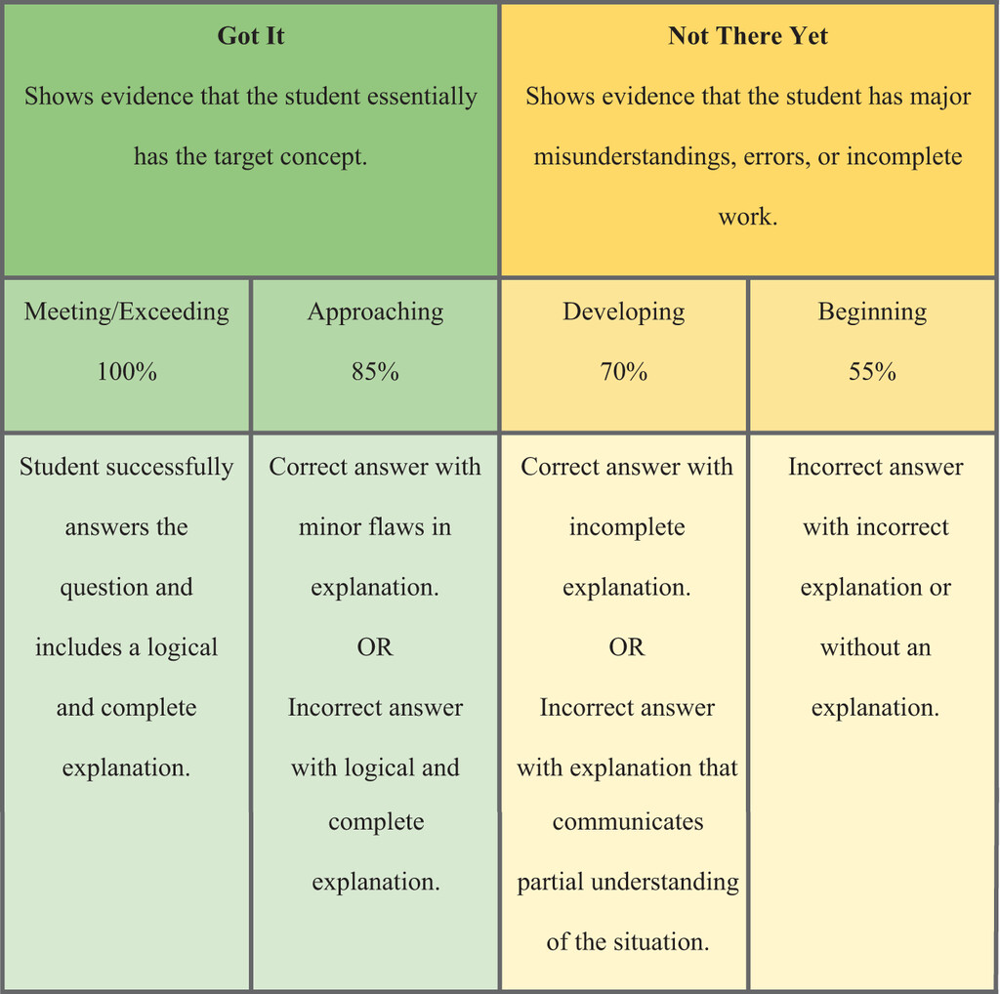

```{r, global_options, include = FALSE}
knitr::opts_chunk$set(
  message = FALSE,
  warning = FALSE,
  comment = NA,
  echo = FALSE,
  fig.align = "center"
)
```

## Formative Assessments

These *lower-stakes* assessments are intended to provide shorter-term feedback about student learning. They are intended to be used by students to improve learning, and by teachers to refine their teaching. 

* They help students identify strengths/weaknesses and target where they need more practice or solidification of ideas
* They help instructors discover where students may be having trouble with course content, in order to address problems

In STT 1810, **formative assessments** include:

* WileyPLUS practice problems
* Engagement activities


##  Summative Assessments 

These assessments evaluate student learning at the end of an instructional unit. Performance is compared to some standard or benchmark related to the goals of the course.

In STT 1810, **summative assessments** include:

* Chapter Investigations
* Research/Media Analyses
* Research Ethics

Information gained from summative assessments and feedback can be used *formatively* to guide student efforts on subsequent activities or in later courses; e.g., later Chapter Investigations are worth more in part because there is a presumption that you will become more proficient across the course.


## Rubric Items

Rubric items for the Chapter Investigations are based on:

* STT 1810 course and general education objectives
* the goals in the relevant chapter(s) of the textbook 

In addition, in order to convey mastery of relevant goals:

* Explanations/discussions should be written in sentences that are grammatically complete/correct and reflect college-level composition skills. 

* Relevant statistical vocabulary must be used consistently and appropriately to achieve the highest level on the rubric.

**Rubric items will be summed/scaled to a final score of 0--100.**


## Rubric Levels for Assessing Mastery


**Meeting/Exceeding (100%):** Correct answers that are supported by logical and complete explanations.

**Approaching (85%):** (1) Correct answers with minor flaws in the explanations OR (2) Incorrect answers with logical or complete explanations.

**Developing (70%):** (1) Correct answers with incomplete explanations OR (2) Incorrect answers with explanations that communicate partial understanding.

**Beginning (55%):** (1) Incorrect answers and explanations OR (2) Incorrect answers with no explanations.

**Cannot assess (0%):** No answer, or the answer is unreadable.


## 

```{r}

```
