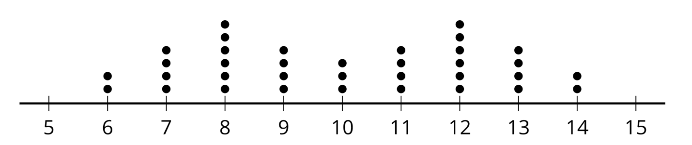

```{r global_options, include = FALSE}
knitr::opts_chunk$set(
  message = FALSE,
  warning = FALSE,
  comment = NA
)
library(tidyverse)
library(kableExtra)
```


## Standard Deviation

Standard deviation can be thought of as roughly the average or typical distance of all the data points from the mean. This is not *quite* mathematically true, but it is close enough, and thinking about it this way can be helpful for interpretation, visualization, and comparison when talking about variables.

In statistics, we usually use $n$ to represent the number of data points. For each point, we find the distance from the mean by subtracting the mean value. What happens next?


$$\text{standard deviation} = SD = \sqrt{\frac{\sum{(point - mean)^2}}{n-1}}$$

Before we take the $\sqrt{\phantom{a}}$ we have a measure known as *variance*.


## Comparing SD 

Standard deviation (SD) is the most commonly used measure of spread / variability in exploratory data analysis. 

<hr>

Consider the 6 plots on the following slides. All have mean = 10.

Look at the distributions of data points in the plots.

Without doing any calculations, sort from smallest to largest SD.

Explain the reasoning you used to decide what order to put the plots in. What aspects or features did you consider?

<hr>

Recall that we can (informally) think of standard deviation as *the average distance of all data points from the mean*.


## Plot A

```{r, echo = FALSE, fig.align="center"}
knitr::include_graphics("../images/SDplotA.png", dpi = 250)
```


## Plot B

<br><br><br><br><br><br><br><br>

```{r, echo = FALSE, fig.align="center"}
knitr::include_graphics("../images/SDplotB.png", dpi = 200)
```


## Plot C

<br><br><br><br><br>

```{r, echo = FALSE, fig.align="center"}
knitr::include_graphics("../images/SDplotC.png", dpi = 200)
```


## Plot D

<br><br><br><br><br><br><br><br>

```{r, echo = FALSE, fig.align="center"}
knitr::include_graphics("../images/SDplotD.png", dpi = 200)
```


## Plot E

<br><br><br><br><br><br><br>

```{r, echo = FALSE, fig.align="center"}
knitr::include_graphics("../images/SDplotE.png", dpi = 200)
```


## Plot F

<br><br><br>

```{r, echo = FALSE, fig.align="center"}
knitr::include_graphics("../images/SDplotF.png", dpi = 200)
```


## All Plots Together

| Plot A    | Plot B    | Plot C    |
|-----------|-----------|-----------|


| Plot D    | Plot E    | Plot F    |
|-----------|-----------|-----------|





## Pause for Group Work!

```{r, echo = FALSE, fig.align="center"}
knitr::include_graphics("../images/stopsign.png", dpi = 190)
```


## 

All plots are symmetric with mean = 10. For Plot D (n = 18)...

| point | distance    | point  | distance    | point  | distance    |
|:-----:|:-----------:|:------:|:-----------:|:------:|:-----------:|
| 6     | 6 - 10 = -4 | **9**  | 9 - 10 = -1 | **11** | 11 - 10 = 1 |
| 7     | 7 - 10 = -3 | **10** | 10 - 10 = 0 | **11** | 11 - 10 = 1 |
| 8     | 8 - 10 = -2 | **10** | 10 - 10 = 0 | **12** | 12 - 10 = 2 |
| 8     | 8 - 10 = -2 | **10** | 10 - 10 = 0 | **12** | 12 - 10 = 2 |
| 9     | 9 - 10 = -1 | **10** | 10 - 10 = 0 | **13** | 13 - 10 = 3 |
| 9     | 9 - 10 = -1 | **11** | 11 - 10 = 1 | **14** | 14 - 10 = 4 |

Points below the mean have a negative distance, points above have a positive distance. The sum without squaring is zero.


## 

We would take all the distances we calculated and square them, then add all the squares together. We divide that sum by $n-1$ $(\text{i.e., } 18 - 1 = 17)$ and, finally, take the square root.

$$\text{standard deviation} = SD = \sqrt{\frac{\sum{(point - mean)^2}}{n-1}}$$

See the provided Google Sheet for the rest of the calculation of standard deviation for Plot D and the data for all six plots.

You can put the *stacked* plot data into the [Descriptive Statistics](https://www.isi-stats.com/isi2nd/ISIapplets2021.html) applet to visualize the plots together and calculate SD.  

<hr>

Note: We will revisit the concept of positive vs. negative distance from the mean in Chapter 1 when we learn about $z$-scores.


## 

| Plot A    | Plot F        | Plot D        |
|-----------|---------------|---------------|
| SD = 0.00 | **SD = 1.65** | **SD = 2.06** |


| Plot E    | Plot B        | Plot C        |
|-----------|---------------|---------------|
| SD = 2.38 | **SD = 2.63** | **SD = 2.94** |


