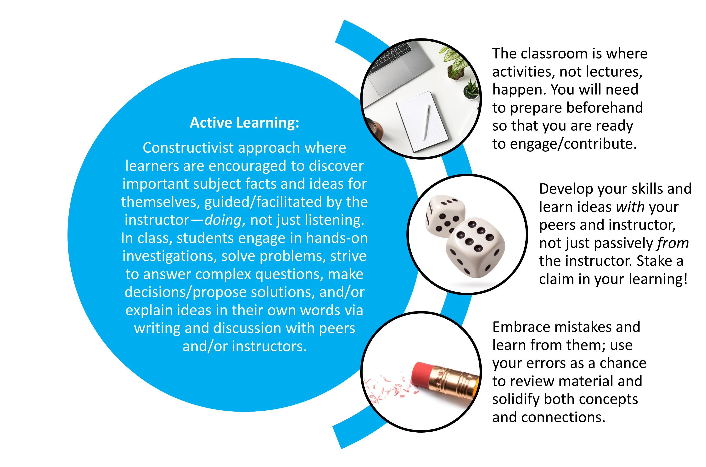
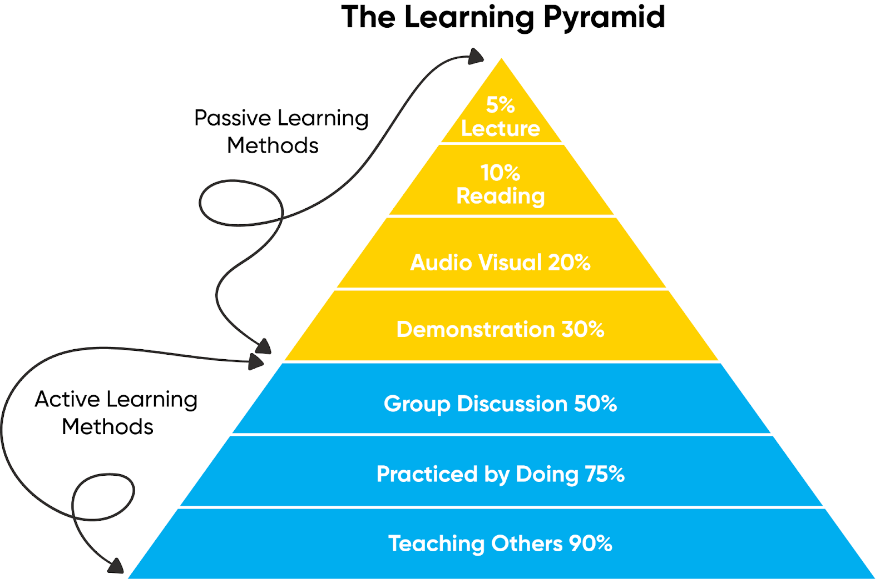
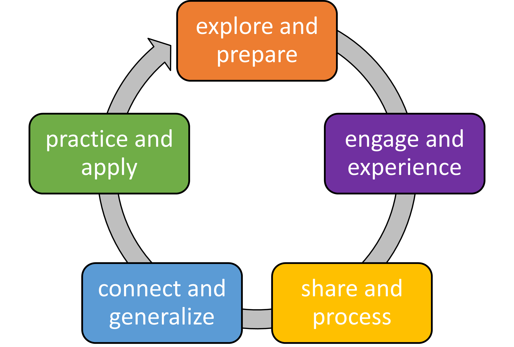

```{r, global_options, include = FALSE}
knitr::opts_chunk$set(
  message = FALSE,
  warning = FALSE,
  comment = NA,
  echo = FALSE,
  fig.align = "center"
)
```


## What is Active Learning?

```{r}

```


## Elements of Active Learning

```{r}

```


## Think-Pair-Share Engagement

```{r}
knitr::include_graphics("images/thinkpairshare02.png", dpi = 200)
```


## Think-Pair-Share Engagement

:::::: {style="display: flex;"}

::: {}

```{r}
knitr::include_graphics("images/thinkpairshare01.png", dpi = 200)
```

:::

::: {}

&nbsp;&nbsp;&nbsp;&nbsp;&nbsp;

:::

::: {}

* explore and prepare / think --- read the textbook, watch videos, learn vocabulary

* engage and experience / pair --- 

* share and process / share ---

* 

:::

::::


## Experiential Learning Cycle

```{r}

```