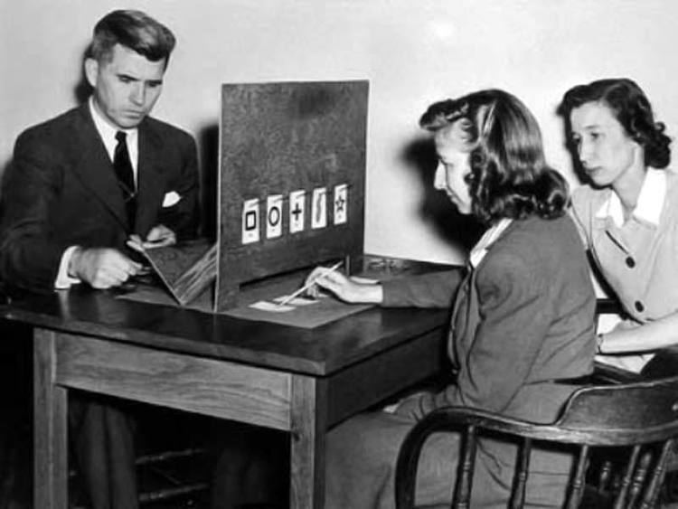

```{r global_options, include = FALSE}
knitr::opts_chunk$set(
  message = FALSE,
  warning = FALSE,
  comment = NA
)
```


## What is ESP?

ESP refers to a reputed collection of abilities, including telepathy (mind reading), psychokinesis (moving objects without physical contact) and precognition (predicting the future). Sometimes it is called "the sixth sense" or "psi". 

The spiritualist movement in 19th-century Britain and the U.S. led to research societies to study paranormal phenomenon; the [Society for Psychical Research](http://www.aspr.com/) still exists! According to a 2003 study in the *Journal for the Scientific Study of Religion*, about 60% of people in the U.S. believe in extrasensory perception (ESP).

The term "extrasensory perception" was widely popularized by J.B. Rhine in the 1930s. He co-created the [Duke Parapsychology Laboratory](https://library.duke.edu/exhibits/2020/parapsychology) to scientifically study ESP. It lasted 35 years; today it exists as the [Rhine Research Center](https://www.rhineonline.org/about-us) in Durham.


## Zener Cards & ESP Test

Psychologists Karl Zener (1903-64) and J.B. Rhine (1895-1980), who worked at Duke University's Parapsychology Laboratory, designed a deck of cards to use in ESP research.

```{r, echo = FALSE, fig.align="center"}
knitr::include_graphics("https://stat-jet-asu.github.io/Moodlepics/admin/zenercards.jpg")
```

The classic Zener card deck has twenty five cards, five of each symbol: a circle, a plus sign, three vertical wavy lines, a square, and a five-pointed star. 


##

In a test for ESP, the experimenter picks a card from a shuffled deck and asks the person being tested to identify which of the five symbols is on the card---without showing them, of course. There are two methods we can use.

* Do not replace drawn cards. Deck size diminishes with each draw and the ratios of symbols left in the deck change.
* Replace previously drawn cards. Deck size and ratios remain the same across all drawings. *We will use type of test.*

If we did a test where someone was presented with 25 cards to guess, how many would they have to get right to make you get suspicious that “something else is going on” --- the person really has ESP, the cards are marked, etc.

<hr>
<p style="text-align: center; color: red; font-weight: bold;">DISCUSS</p>
<hr>


## Take the Test!

Let's get some actual data to use in our discussion. We will use an online test rather than physical cards like Dr. Rhine (below).

```{r, echo = FALSE, fig.align="center"}

```

<hr>
<p style="text-align: center;">[Do you have ESP?](https://psychicscience.org/esp3)</p>
<hr>


## Test Instructions

Use the default settings: Clairvoyance, Open deck, Cards seen, and 25 cards. Take the test and record your number of "hits".

```{r, echo = FALSE, fig.align="center"}
knitr::include_graphics("images/ESP01.PNG", dpi = 110)
```


## Dr. Thomley's Results

What do you think? Based on the test evidence, is Dr. Thomley psychic? Are you? *Discuss.*

```{r, echo = FALSE, fig.align="center"}
knitr::include_graphics("images/ESP02.PNG", dpi = 110)
```


## Some Additional Questions...

How often would a person who does *not* have any ESP abilities (and who is not cheating) get a "hit"? Is it *never*?

How does randomness (chance) play into the overall process of the test? Does randomness help or hurt our scientific method?

The online test says, "choose at least 50 trials to obtain a reliable indication of your performance" and offers 50, 100, 200, 500, or even 1000 trials! Why would more trials be more "reliable"? 

Is there a way we can logically/scientifically quantify the strength of the evidence provided by our data?

<hr>
<p style="text-align: center; color: red; font-weight: bold;">DISCUSS</p>
<hr>


## Connection to Our Text

Review Preliminaries Section P.1 of the *Introduction to Statistical Investigations, 2^nd^ Edition* textbook.

As we introduce the **Six Steps of a Statistical Investigation** and the **Four Pillars of Statistical Inference**, can you connect those ideas to what we did and talked about in this activity?

What might **anecdotal evidence** (e.g., personal observations of striking examples) consist of in the context of trying to figure out whether some people *really* possess ESP ability? Why is this kind of "evidence" less valid than a statistical investigation?

<hr>
<p style="text-align: center; color: red; font-weight: bold;">ONWARD!</p>
<hr>


## 

Bill Murray does a *very* unethical Zener card test in *Ghostbusters*.

<iframe width="560" height="315" src="https://www.youtube.com/embed/5ohlA__xABw" frameborder="0" allow="accelerometer; autoplay; clipboard-write; encrypted-media; gyroscope; picture-in-picture" allowfullscreen></iframe>
