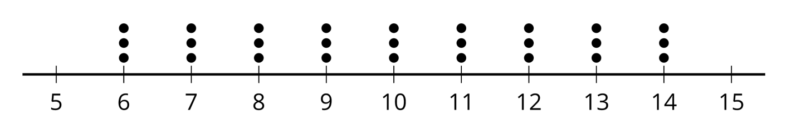
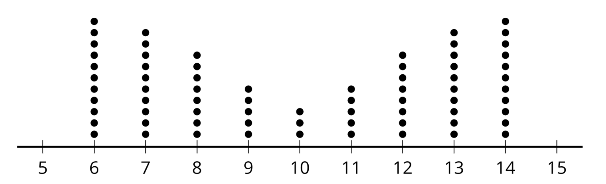
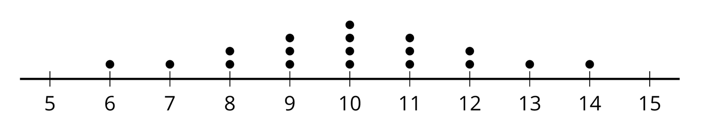
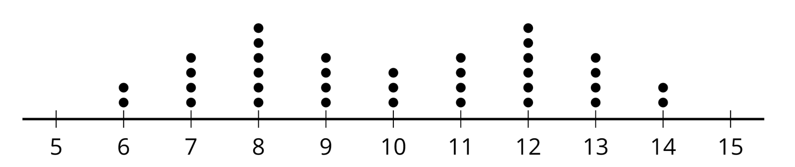
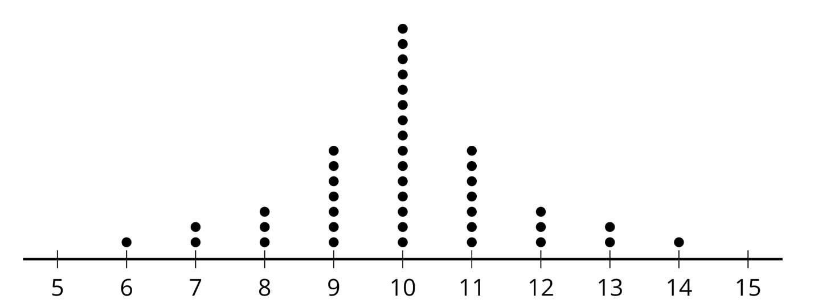

```{r global_options, include = FALSE}
knitr::opts_chunk$set(
  message = FALSE,
  warning = FALSE,
  comment = NA
)
library(tidyverse)
library(kableExtra)
```


## Standard Deviation

Standard deviation (SD) is the most commonly used measure of spread / variability in exploratory data analysis. 

<hr>

Consider the six plots on the following slides. 

Look at the distributions of data points in the plots.

Without doing any calculations, sort from smallest to largest SD.

Explain the reasoning you used to decide what order to put the plots in. What aspects or features did you consider?

<hr>

Recall that we can (informally) think of standard deviation as *the average distance of all data points from the mean*.


## Plot A

```{r, echo = FALSE, fig.align="center"}
knitr::include_graphics("images/SDplotA.png", dpi = 250)
```


## Plot B

<br><br><br><br><br><br><br><br>

```{r, echo = FALSE, fig.align="center"}
knitr::include_graphics("images/SDplotB.png", dpi = 200)
```


## Plot C

<br><br><br><br><br>

```{r, echo = FALSE, fig.align="center"}
knitr::include_graphics("images/SDplotC.png", dpi = 200)
```


## Plot D

<br><br><br><br><br><br><br><br>

```{r, echo = FALSE, fig.align="center"}
knitr::include_graphics("images/SDplotD.png", dpi = 200)
```


## Plot E

<br><br><br><br><br><br><br>

```{r, echo = FALSE, fig.align="center"}
knitr::include_graphics("images/SDplotE.png", dpi = 200)
```


## Plot F

<br><br><br>

```{r, echo = FALSE, fig.align="center"}
knitr::include_graphics("images/SDplotF.png", dpi = 200)
```


## All Plots Together

| Plot A    | Plot B    | Plot C    |
|-----------|-----------|-----------|





| Plot D    | Plot E    | Plot F    |
|-----------|-----------|-----------|






## Pause for Group Work!

```{r, echo = FALSE, fig.align="center"}
knitr::include_graphics("images/stopsign.png", dpi = 190)
```


## The Solutions

All plots are symmetric with mean = 10. For Plot D...

| point | distance    | point  | distance    | point  | distance    |
|:-----:|:-----------:|:------:|:-----------:|:------:|:-----------:|
| 6     | 6 - 10 = -4 | **9**  | 9 - 10 = -1 | **11** | 11 - 10 = 1 |
| 7     | 7 - 10 = -3 | **10** | 10 - 10 = 0 | **11** | 11 - 10 = 1 |
| 8     | 8 - 10 = -2 | **10** | 10 - 10 = 0 | **12** | 12 - 10 = 2 |
| 8     | 8 - 10 = -2 | **10** | 10 - 10 = 0 | **12** | 12 - 10 = 2 |
| 9     | 9 - 10 = -1 | **10** | 10 - 10 = 0 | **13** | 13 - 10 = 3 |
| 9     | 9 - 10 = -1 | **11** | 11 - 10 = 1 | **14** | 14 - 10 = 4 |


## 

| Plot A    | Plot F        | Plot D        |
|-----------|---------------|---------------|
| SD = 0.00 | **SD = 1.65** | **SD = 2.06** |


| Plot E    | Plot B        | Plot C        |
|-----------|---------------|---------------|
| SD = 2.38 | **SD = 2.63** | **SD = 2.94** |


